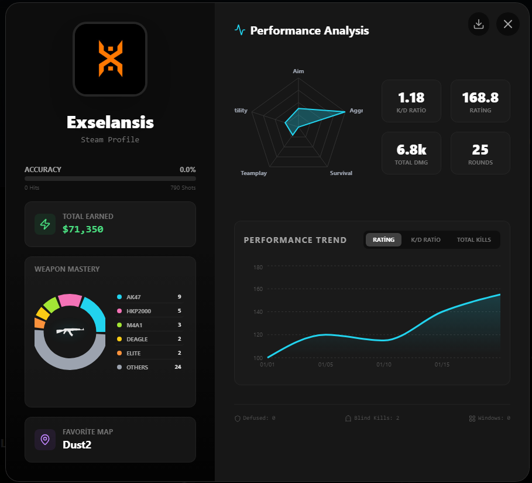
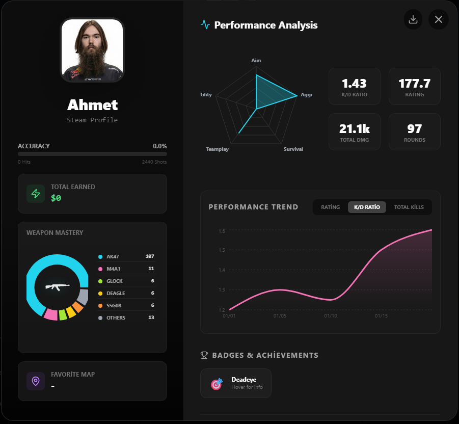
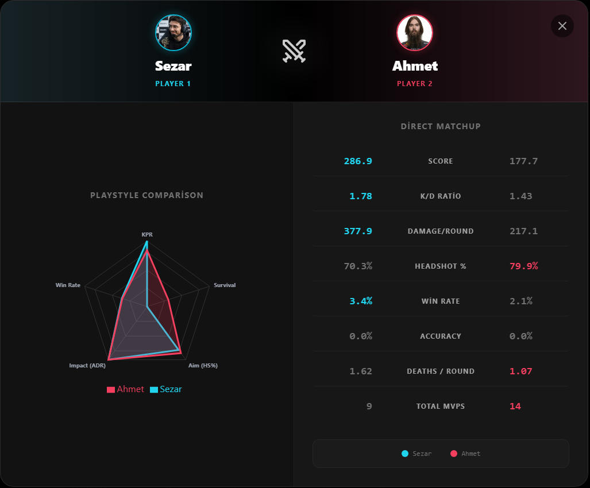
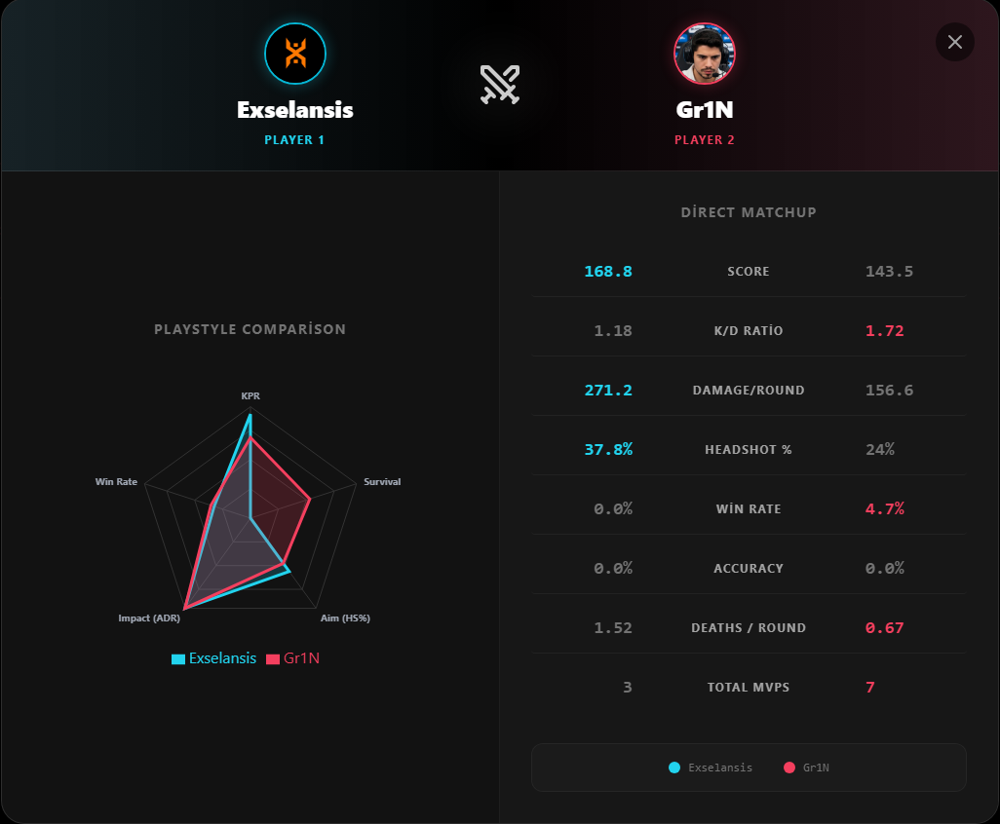
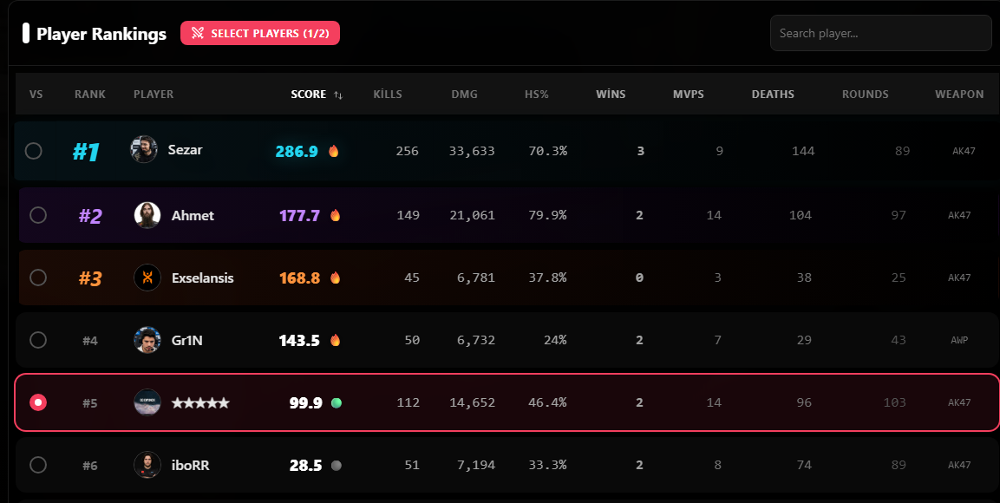
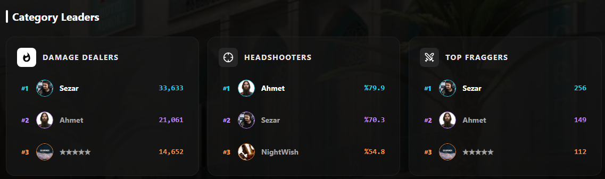
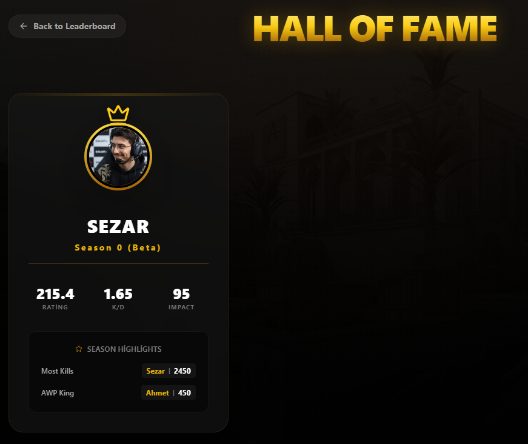

# 🏆 CS2 Community Leaderboard


**A modern, aesthetic, and automated leaderboard tracking system for Counter-Strike 2 communities.**

[About The Project](#-about-the-project) • [Features](#-features) • [Showcase](#-showcase) • [Installation & Setup](#-installation--setup)

---

## 📖 About The Project

This project is a **custom leaderboard web application** designed to track and display competitive statistics for a group of CS2 players. It goes beyond simple tables by offering a **gamified experience** with monthly seasons, Hall of Fame tracking, detailed player profiles, and versus comparisons.

Unlike standard static tables, this leaderboard offers a strictly premium user experience with **podium views**, **search/filtering**, **detailed metric tracking** (Kills, Damage, Wins, MVP, etc.), and **automated Discord integration** (Coming Soon).

## ✨ Features

- **👑 Dynamic Podium System:** Top 3 players are highlighted in a visually stunning 3D-style podium layout.
- **🏛️ Hall of Fame:** Automatically archives monthly champions and displays them in a dedicated trophy room.
- **🆚 Versus Mode:** Compare any two players head-to-head to see who dominates in key metrics.
- **📊 Detailed Player Profiles:** Click on any player to see deep dives:
  - **Radar Charts:** For playstyle analysis (Aim, Utility, Survival etc.).
  - **Weapon Mastery:** Identifying the player's most lethal weapons using pie charts.
- **🔄 Monthly Seasons:** The system automatically resets every month, saving the winner to the Hall of Fame.
- **📈 Automated Data Fetching:** A Python script connects to the Steam Web API to fetch the latest matchmaking stats.
- **🎨 Premium UI/UX:** Built with TailwindCSS for a dark, tactical, and responsive design featuring glassmorphism and smooth animations.

## 📸 Showcase

### 🏆 The Podium


### 👤 Player Profile & Weapon Mastery




### ⚔️ Versus Mode & Analytics




### 📋 Rankings & Categories




### 🏛️ Hall of Fame



## 🔫 Weapon Stats Tracking

We track mastery for all major CS2 weapons. Who is the AWP King? Who sprays the best with the AK-47?

       

## 🛠️ How It Works

1. **Data Collection (Python):**
    - The `scripts/data-parse.py` script runs and queries the Steam User Stats API for every player defined in `players.json`.
    - It uses a **Monthly Rotation Logic**: Checks if the month has changed. If so, it crowns the winner, updates `hall_of_fame.json`, and resets the baseline for the new season.
    - The processed data is saved to `src/data.json`.

2. **Visualization (React & Recharts):**
    - The React app imports `data.json`.
    - Dynamic routing handles `/` (Leaderboard) and `/hall-of-fame` pages.
    - Components like `WeaponChart` and `VersusModal` use real-time data to render visualizations.

## 🚀 Installation & Setup

### Prerequisites

- Node.js (v18+)
- Python 3.x
- A valid **Steam Web API Key**

### 1. Clone the Repository

```bash
git clone https://github.com/yourusername/cs2-leaderboard.git
cd cs2-leaderboard
```

### 2. Install Dependencies

```bash
npm install
```

### 3. Configure Players & API

1. Create a `.env` file or export your Steam API Key:

    ```bash
    export API_KEY="YOUR_STEAM_API_KEY"
    ```

2. Edit `scripts/players.json` to add your friends:

    ```json
    {
      "YourFriend": "76561198xxxxxxxxx",
      "AnotherPlayer": "76561198xxxxxxxxx"
    }
    ```

### 4. Fetch Initial Data

Run the python script to pull data from Steam.

```bash
python scripts/data-parse.py
```

### 5. Run the Application

Start the local development server.

```bash
npm run dev
```

Open `http://localhost:5173` in your browser.
