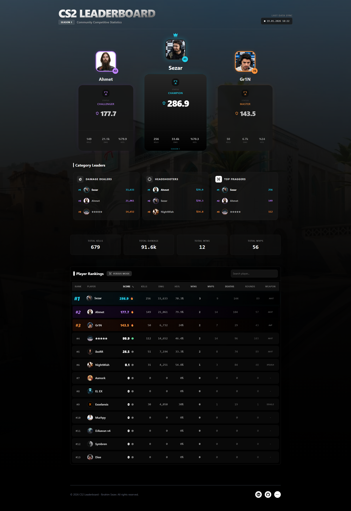

# 🏆 CS2 Community Leaderboard



<div align="center">


**A modern, aesthetic, and automated leaderboard tracking system for Counter-Strike 2 communities.**

[Features](#-features) • [Installation](#-installation) • [How It Works](#-how-it-works) • [Screenshots](#-screenshots)

</div>

---

## 📖 About The Project

This project is a **custom leaderboard web application** designed to track and display competitive statistics for a group of CS2 players. It combines a robust **Python** data fetching script with a beautiful **React** frontend to show real-time rankings, detailed stats, and visualize performance trends.

Unlike standard static tables, this leaderboard offers a strictly premium user experience with **podium views**, **search/filtering**, and **detailed metric tracking** (Kills, Damage, Wins, MVP, etc.).

## ✨ Features

- **👑 Dynamic Podium System:** Top 3 players are highlighted in a visually stunning 3D-style podium layout.
- **📊 Real-Time Sorting:** Sort the leaderboard by any metric (Score, Kills, Damage, HS%, etc.) with a single click.
- **🔍 Instant Search:** Quickly find specific players within the table.
- **📈 Automated Data Fetching:** A Python script connects to the Steam Web API to fetch the latest matchmaking stats.
- **⚔️ Seasonal Tracking:** Automatically calculates "Season" stats by comparing current totals against a baseline snapshot.
- **🎨 Premium UI/UX:** Built with TailwindCSS for a dark, tactical, and responsive design featuring glassmorphism and smooth animations.

## 🛠️ How It Works

1. **Data Collection (Python):**
    - The `scripts/data-parse.py` script runs and queries the Steam User Stats API for every player defined in `players.json`.
    - It fetches real profiles (Avatar, Name) and game stats (Kills, Deaths, Wins...).
    - It calculates the difference (Delta) from the start of the season (`baseline.json`).
    - The processed data is saved to `src/data.json`.

2. **Visualization (React):**
    - The React app imports `data.json`.
    - The `<App />` component distributes data to the **Podium** (`Leaders.jsx`) and **Table** (`Table.jsx`) components.
    - The UI updates instantly with the latest JSON data.

## 🚀 Installation & Setup

### Prerequisites

- Node.js (v18+)
- Python 3.x
- A valid **Steam Web API Key**

### 1. Clone the Repository

```bash
git clone https://github.com/yourusername/cs2-leaderboard.git
cd cs2-leaderboard
```

### 2. Install Dependencies

```bash
npm install
```

### 3. Configure Players & API

1. Create a `.env` file or export your Steam API Key:

    ```bash
    export API_KEY="YOUR_STEAM_API_KEY"
    # or inside the script manually (not recommended for public repos)
    ```

2. Edit `scripts/players.json` to add your friends:

    ```json
    {
      "YourFriend": "76561198xxxxxxxxx",
      "AnotherPlayer": "76561198xxxxxxxxx"
    }
    ```

### 4. Fetch Initial Data (Baseline)

Run the python script to pull data from Steam.

```bash
python scripts/data-parse.py
```

### 5. Run the Application

Start the local development server.

```bash
npm run dev
```

Open `http://localhost:5173` in your browser.

## 📸 Screenshots

| **Podium View** | **Detailed Table** |
|:---:|:---:|
|  | *Table with sorting and search capabilities.* |

## 🤝 Contributing

Contributions are welcome! Please feel free to submit a Pull Request.

1. Fork the Project
2. Create your Feature Branch (`git checkout -b feature/AmazingFeature`)
3. Commit your Changes (`git commit -m 'Add some AmazingFeature'`)
4. Push to the Branch (`git push origin feature/AmazingFeature`)
5. Open a Pull Request

## 📄 License

Distributed under the MIT License. See `LICENSE` for more information.
